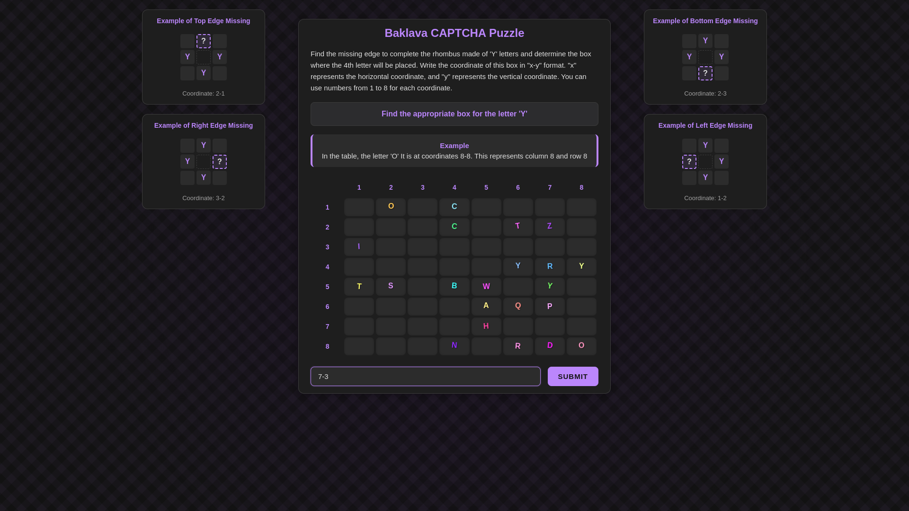

# Baklava CAPTCHA

A modern, interactive CAPTCHA system that presents users with a visually engaging puzzle based on letter patterns in a rhombus shape. This system is designed to be both secure and user-friendly while being resistant to automated OCR (Optical Character Recognition) attacks.

## Overview

Baklava CAPTCHA creates an 8x8 grid where letters are arranged in a rhombus pattern. Users need to identify the missing position that would complete the rhombus shape made up of identical letters. The system incorporates various visual elements and randomization to make automated solving difficult while keeping the puzzle intuitive for humans.

## Features

- Interactive 8x8 grid-based puzzle
- Dynamic letter placement with rhombus patterns
- Visual enhancements:
  - Random color variations for each letter
  - Subtle rotation effects
  - Animated hover states
  - Randomized letter positions
- Clear coordinate-based answer system
- Visual examples and instructions

## How It Works

1. The system generates a rhombus pattern using a randomly selected letter.
2. One edge of the rhombus is removed.
3. Users need to identify the coordinates (in "x-y" format) where the missing letter should be placed.
4. Additional random letters are placed on the grid to increase complexity.
5. Visual effects are applied to thwart automated OCR attempts.

## Usage

1. **Install Dependencies**

   Ensure you have Go (version 1.23.5 or higher) installed, then run:
   ```bash
   go mod tidy
   ```

2. **Set Up Environment Variables**

   In the project's root directory, open the existing .env file and replace the dummy values with a secure, randomly generated 32-character alphanumerical key. You can generate one using [this generator](https://passwords-generator.org/alphanumeric).

3. **Start the Server**

   Run the application with:
   ```bash
   go run .
   ```

4. **Access the CAPTCHA System**

   Open your web browser and navigate to:
   ```
   http://localhost:8080
   ```

5. **Solve the CAPTCHA**

   Enter the coordinates of the missing letter in "x-y" format (e.g., "4-6").

## Requirements

- Go 1.23.5 or higher

### Screenshots


---

---

